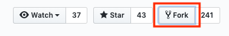
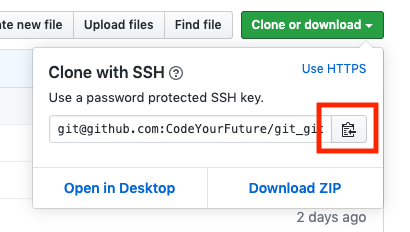
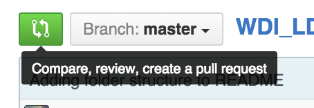

# CodeYourFuture Student Class Exercise - Git/GitHub

Welcome to this exercise to help you practice the use of Git & GitHub

This exercise is based around a single HTML page that makes use of separate CSS, JavaScript and image assets. The files provided are stored in a typical directory structure for a page like this, and are linked using relative paths in the `<head></head>` of the HTML file for the CSS and JavaScript files, and in the `<body></body>` for the images where used.

## Setup

### Step 1. Fork the repository

First, [fork](https://help.github.com/articles/fork-a-repo) this repository to your own GitHub account by clicking the fork button.

- [https://github.com/CodeYourFuture/git_github_exercise](https://github.com/CodeYourFuture/git_github_exercise)



### Step 2. Create your directory

In the folder you want to use for development work, create a folder with your github nickname.

```bash
.
├── README.md
└── github-username-directory
```

Then change into that direction

```bash
cd [URL to your directory]
```

### Step 3. Clone your fork

In GitHub, locate the 'Clone or download' button, select the HTTPS option, then click on the clipboard to copy the path of the repo



Next, clone your fork from your GitHub repo to your local machine using 

```bash
  git clone [URL to your repo]
```

### Step 4

1. From your command line, open VSCode using `code .` - Take careful note that there is a period (full-stop) at the end of that command.
2. Take a look around the code inside VSCode and get a feel for how the directory is structured with HTML, CSS, JavaScript and assets all located within their own directories.
3. Open the `index.html file in your browser by right-clicking on the HTML file and selecting the 'Open in default browser option'. You should now see a form very similar to the one you completed when you applied to CodeYourFuture, but it still need more work...
4. Complete the following tasks:
	5. Make the inputs for First Name, Last Name, Email and Password mandatory by adding an asterisk `*` to the end of their associated label, and then style it to show in red. Hint: Check your CSS file to see if there's already a rule that you could use for that.
	6. One of the inputs near the bottom of the form isn't currently being used for anything. Turn it into a "How did you hear about us? *" input, and add an approproate placeholder.
	7. Some of the placeholders for the other fields currently contain dummy text, or nothing - change those as necessary.


## Submitting work

### Step 1. Create a week/day folder

When you are going to add a new homework, first create a directory with the information about the week and the day like with the format `w01d02` (for week one, day two).

Your folder structure should look something like this:

```
.
├── README.md
└── github-username-directory
    └── w01d02
```

### Step 2. Push to your fork

At the end of each day (or first thing each morning), ensure all of your homework is committed to git and pushed to your github fork of the student work repository.

### Step 3. Submit a pull request

Then create a [pull request](https://help.github.com/articles/using-pull-requests) from your fork. This will automatically include all the commits you have made to the repository.



### Step 3. Add a title and comment

Add the title of exercise to the pull request, e.g. "Git/GitHub Exercise".

Then add a comment to the pull request. Your comment should follow this format:

```
* Comfortability [0 to 5]
* Completeness [0 to 5]
* What was a win?
* What was a challenge?
* Any other comments
```

The volunteer team will then review your pull request, and use the main repository as the source to monitor your work.

If you have any problems with submitting assignments, ask a volunteer to help you.
